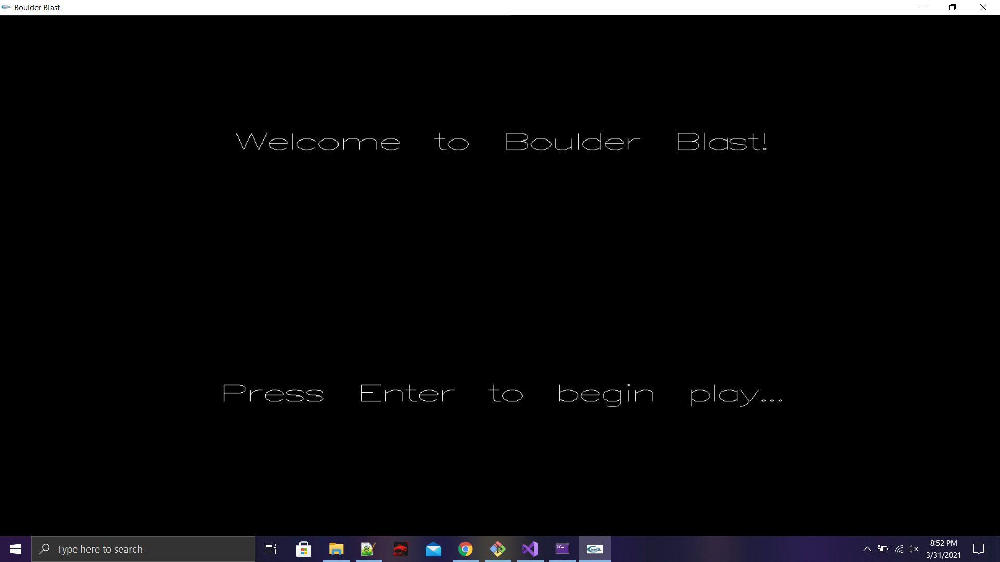
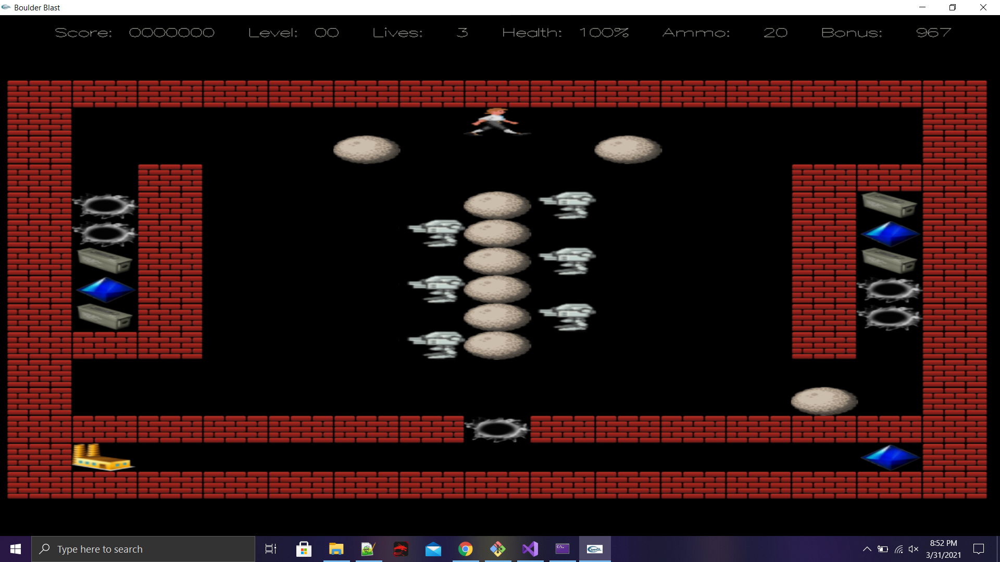
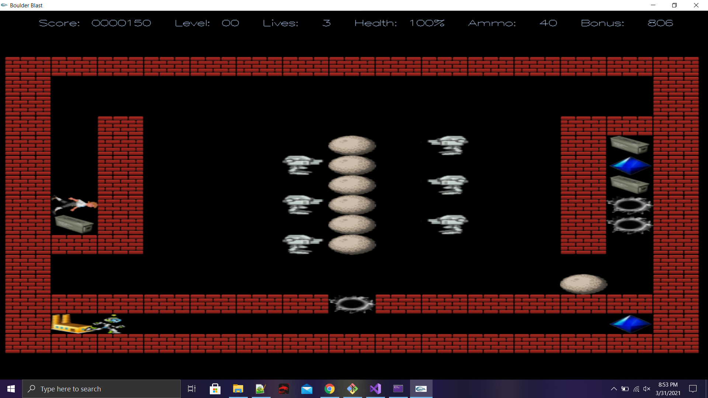
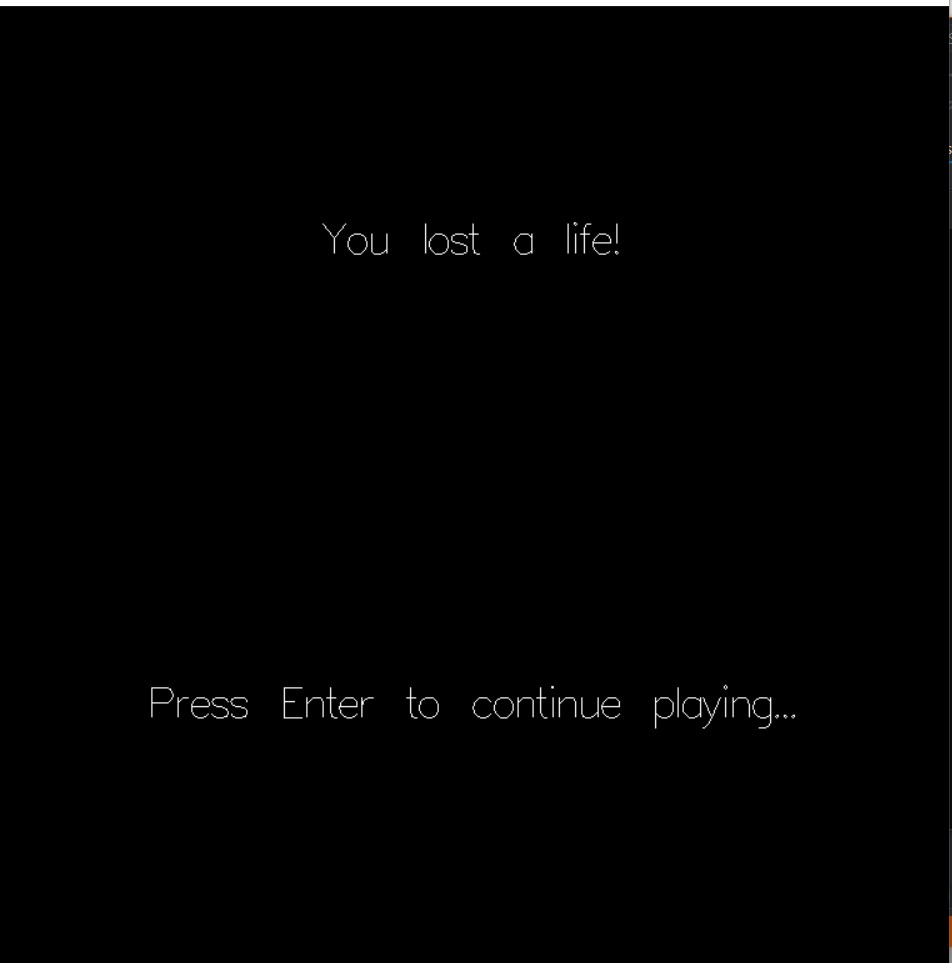

# BoulderBlast
A CS project from UCLA's CS 32 course
## Author: Kevin Delao

## Table of contents

* [Introduction](#intro)
* [General info](#general-info)
* [Technologies](#technologies)
* [Site](#site)
* [Setup](#setup)

## Introduction
The goal of this project was to create a video game where a player would traverse a 2D world filled with killer robots. The player would win each level by either killing off the robots or 
collecting all the jewels in each level.

## General info
This application was built in C++ and was a main project for UCLA's CS 32 project from before. To read what exactly were the requirments to complete the project for the course please see the Project_Details.pdf
on the repo to view the entire project spec.
	
## Technologies
Project was created with:
* C++
* Visual Studios

## Site

### Homepage
The homepage or start up page consists of a welcome message that tells the user welcome to BoulderBlast. From there the user has the option to push enter and start the game.

### Starting off
The Player will start off right off in a level filled with boulders and robots. The player character can be controlled with the directional key buttons and the user has the choice to move around in the level.
Initially the player will have no points or bullets and the user must look around the map to find them while avoiding the robots. The boulders can be pushed into the "black holes" that block weapon and jewels.
  

 
### Finding Jewels and weapons
Once the path is cleared to access jewels and weapons the user can pick them up for points and to have the resources to fire at the robots.
 
 
 
### User Status Bar
At the top of the game there are various player information that the user can look at to see their progress. The user can see how many points they have so far which can be obtained by destroying robots or collecting jewels.
The user can also see how manny lives they have what is their current health.

  
 

### Game Over

When the player dies the user will be shown a you lost a life screen. From there the user can push enter to retry the level. If all lives are lost then the player will get a gameover screen
and the player will have to start from scratch.
 

## Setup
To run this project properly open visual code and select find a solution and select BoulderBlast.sln in the folder. Once started up you will need to change the main.cpp and change the file path for Assets
and make it to wherever the path for Assets says for you. After this simply run the project and the game should load up.

